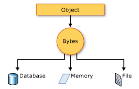

Serialização (C#) 
</h3>

<blockquote align="center">“A serialização é o processo de converter um objeto em um fluxo de bytes para armazenar o objeto ou transmiti-lo para a memória, 
um banco de dados ou um arquivo. Sua finalidade principal é salvar o estado de um objeto para recriá-lo quando necessário. 
O processo inverso é chamado desserialização”</blockquote>

## :rocket: Como a serialização funciona:

Esta ilustração mostra o processo geral de serialização:

O objeto é serializado para um fluxo que transporta os dados. O fluxo também pode ter informações sobre o tipo do objeto, como sua versão, cultura e nome do assembly. 
A partir desse fluxo, o objeto pode ser armazenado em um banco de dados, em um arquivo ou em uma memória.

## Usos para serialização:

A serialização permite que o desenvolvedor salve o estado de um objeto e recrie-o conforme necessário, 
fornecendo armazenamento de objetos, bem como troca de dados. Por meio da serialização, um desenvolvedor pode executar ações como:
 

* Enviando o objeto para um aplicativo remoto usando um serviço Web.

* Passando um objeto de um domínio para outro.

* Passando um objeto por meio de um firewall como uma cadeia de caracteres JSON ou XML.

* Manter informações específicas de segurança ou de usuário entre aplicativos.

## Serialização JSON

O System.Text.Json namespace contém classes para serialização e desserialização de JavaScript Object Notation (JSON). JSON é um padrão aberto que normalmente é usado para compartilhar dados na Web.

A serialização JSON serializa as propriedades públicas de um objeto em uma cadeia de caracteres, matriz de bytes ou fluxo que está em conformidade com a especificação JSON RFC 8259. Para controlar a maneira de JsonSerializer serializar ou desserializar uma instância da classe:

* Usar um JsonSerializerOptions objeto.

* Aplicar atributos do System.Text.Json.Serialization namespace a classes ou propriedades.

* Implementar conversores personalizados.

## Serialização XML e binária

O System.Runtime.Serialization namespace contém classes para serialização e desserialização binária e XML.

A serialização binária usa a codificação binária para produzir uma serialização compacta para usos como armazenamento ou fluxos de rede com base em soquete. Na serialização binária, todos os membros, mesmo aqueles que são somente leitura, são serializados e o desempenho é aprimorado.

A serialização XML serializa as propriedades e os campos públicos de um objeto, ou os parâmetros e os valores de retorno de métodos, em um fluxo XML que esteja de acordo com um documento XSD (linguagem de definição de esquema XML) específico. A serialização XML resulta em classes fortemente tipadas com propriedades e campos públicos que são convertidos em XML. System.Xml.Serializationcontém classes para serialização e desserialização de XML. Aplique atributos a classes e a membros de classe para controlar a maneira como o XmlSerializer serializa ou desserializa uma instância da classe.

## Tornando um objeto serializável

Para serialização binária ou XML, você precisa de:

* O objeto a ser serializado

* Um fluxo para conter o objeto serializado

* Uma System.Runtime.Serialization.Formatter

Aplique o SerializableAttribute atributo a um tipo para indicar que as instâncias do tipo podem ser serializadas. Uma exceção será gerada se você tentar serializar, mas o tipo não terá o atributo SerializableAttribute.

Para impedir que um campo seja serializado, aplique o NonSerializedAttribute atributo. Se um campo de um tipo serializável contiver um ponteiro, um identificador ou outra estrutura de dados que é específica de um determinado ambiente e o campo não puder ser reconstituído em um ambiente diferente, será necessário torná-lo não serializável.

Se uma classe serializada contiver referências a objetos de outras classes que estão marcadas como SerializableAttribute, esses objetos também serão serializados.

## Serialização básica e personalizada

A serialização binária e XML pode ser executada de duas maneiras, básicas e personalizadas.

A serialização básica usa o .NET para serializar automaticamente o objeto. O único requisito é que a classe tenha o SerializableAttribute atributo aplicado. O NonSerializedAttribute pode ser usado para impedir a serialização de campos específicos

Quando você usa a serialização básica, a criação de versão de objetos pode criar problemas. Use a serialização personalizada quando problemas de criação de versão forem importantes. A serialização básica é a maneira mais fácil de executar a serialização, mas ela não fornece muito controle sobre o processo.

Na serialização personalizada, você pode especificar exatamente quais objetos vão ser serializados e como isso será feito. A classe deve ser marcada como SerializableAttribute e implementar a interface ISerializable. Se você quiser que seu objeto seja desserializado de uma maneira personalizada também, use um construtor personalizado.

## Serialização de designer

A serialização de designer é um formulário especial de serialização que envolve o tipo de persistência do objeto associado a ferramentas de desenvolvimento. A serialização de designer é o processo de conversão de um grafo do objeto em um arquivo de origem que pode, posteriormente, ser usado para recuperar o grafo do objeto. Um arquivo de origem pode conter código, marcação ou até mesmo informações de tabela do SQL.

